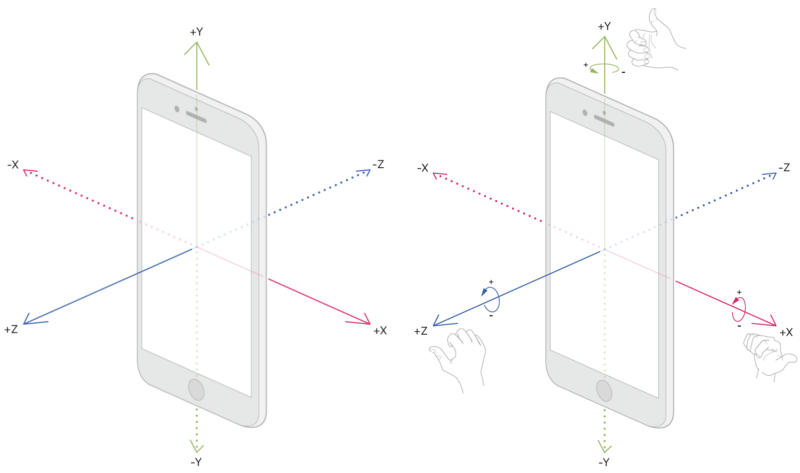

# Advanced Usage
The purpose of this Advanced Usage Guide is to provide additional tooling, tips, and guidance for building activity classification models.

## Tips And "Gotchas"

-  **Training Data**: The training data used for the activity classifier consists of sensor readings from the accelerometer and gyroscope of a mobile device, paired with a session id (Experiment) and a label (Activity). Don't expect the model to properly classify an activity that it didn't see during the training step.
    -  **Key Point:** When you train a model, the nature of the training data directly influences the model's ability to make predictions in the wild. 
- **Wrangling Sensor Data w/ Turi Create**: In order to train this model with Turi Create, the HAPT activity data needed to be wrangled into the format shown below. Learn more about how to do this in [Turi Create's example](https://apple.github.io/turicreate/docs/userguide/activity_classifier/data-preparation.html), or in the `activity_data_in_turicreate.ipynb` guide.

|    |   Experiment | Activity   |   Accelerometer_X |   Accelerometer_Y |   Accelerometer_Z |   Gyroscope_X |   Gyroscope_Y |   Gyroscope_Z |
|---:|-------------:|:-----------|------------------:|------------------:|------------------:|--------------:|--------------:|--------------:|
|  0 |            1 | standing   |           1.02083 |         -0.125    |          0.105556 |  -0.00274889  |  -0.00427606  |    0.00274889 |
|  1 |            1 | standing   |           1.025   |         -0.125    |          0.101389 |  -0.000305433 |  -0.00213803  |    0.00610865 |
|  2 |            1 | standing   |           1.02083 |         -0.125    |          0.104167 |   0.0122173   |   0.000916298 |   -0.00733038 |

# ...

|        |   Experiment | Activity          |   Accelerometer_X |   Accelerometer_Y |   Accelerometer_Z |   Gyroscope_X |   Gyroscope_Y |   Gyroscope_Z |
|-------:|-------------:|:------------------|------------------:|------------------:|------------------:|--------------:|--------------:|--------------:|
| 748401 |           61 | climbing_upstairs |          0.880556 |         -0.390278 |        -0.156944  |       1.1637  |      1.10628  |    -0.374155  |
| 748402 |           61 | climbing_upstairs |          0.834722 |         -0.358333 |        -0.0986111 |       1.17714 |      1.02381  |    -0.388816  |
| 748403 |           61 | climbing_upstairs |          0.802778 |         -0.329167 |        -0.104167  |       1.21348 |      0.91813  |    -0.332311  |

-  **Sensors**: The general format of this data is that each experiment contains 6 measurements. 3 axes collected from an **accelerometer** and a **gyroscope**. The accelerometer provides changes in mobile device’s velocity along 3 axes, and a gyroscope delivers the rate at which a device rotates around a spatial axis. See the image below. The left device shows an accelerometer and the right device shows a gyroscope.

-  **Collecting Sensor Data**: Sensor data can be collected at different time intervals. The training data set for this example (HAPT), which contains data for different users performing multiple activities, was sampled at 50Hz, or 50 times per second. It is **VITAL** that sensor data used to train an activity classifier is sampled at the same frequency throughout. Sensor data that the model is actively attempting to classify must also be at the same sampling frequency. [Read this blog to learn more about collecting sensor data from an iPhone](https://towardsdatascience.com/run-or-walk-part-2-collecting-device-motion-data-the-right-way-58a277ff2087).
    -   If your app doesn't already collect motion data, check out [this app](https://itunes.apple.com/us/app/sensor-kinetics/id579040333?mt=8) that allows you to mess around with the gyroscope and accelerometer on an iPhone.
    -  To see an example of data being generated, take a look at this [video](https://www.youtube.com/watch?v=XOEN9W05_4A).

-  **Prediction Window**: Depending on your application or use-case you may want a model that generates an activity prediction every *N* seconds. Set the `prediction_window` parameter in the model training step to be *N* x *sampling_frequency*. So if you wanted your model to give a prediction every 5 seconds and the sensors are sampled at 50Hz, you would set the prediction window to 250 ~ (5 sec * 50 samples per second).

## Resources
-  `activity_data_in_turicreate.ipynb`: Gives some tips on adapting your text classifier to a **NEW** set of data, detailing proper formatting and several helper functions.
-  To find out more about how this data was generated, take a look at the following [link](https://archive.ics.uci.edu/ml/datasets/Human+Activity+Recognition+Using+Smartphones).

## Need Help?
Didn't find something you need? Confused by something? Need more guidance?

Please contact us with questions or feedback! Here are two ways:

-  [**Signup for our Slack Channel**](https://join.slack.com/t/metismachine-skafos/shared_invite/enQtNTAxMzEwOTk2NzA5LThjMmMyY2JkNTkwNDQ1YjgyYjFiY2MyMjRkMzYyM2E4MjUxNTJmYmQyODVhZWM2MjQwMjE5ZGM1Y2YwN2M5ODI)
-  [**Find us on Reddit**](https://reddit.com/r/skafos)

Also check out Turi Create's [**documentation**](https://apple.github.io/turicreate/docs/userguide/activity_classifier/) on activity classification basics.
